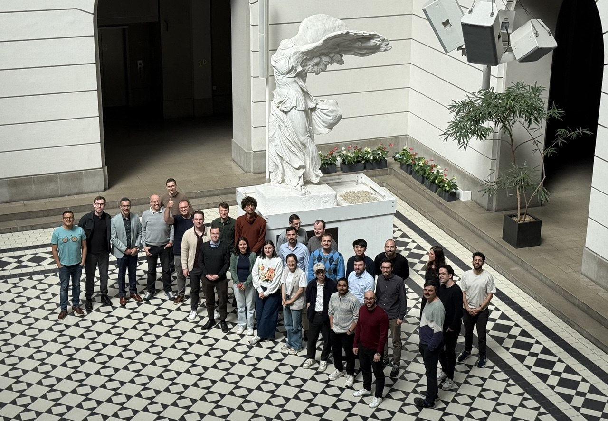

---
# Feel free to add content and custom Front Matter to this file.
# To modify the layout, see https://jekyllrb.com/docs/themes/#overriding-theme-defaults

layout: default
---

# Resilient (Resilient Energy System Infrastructure Layouts for Industry, E-Fuels and Network Transitions)

The energy transition faces many uncertainties, yet planning tools are often deterministic. Our proposal aims to develop the first truly multi-vector energy infrastructure planning tool that represents this uncertain environment at regional, national, and European levels.

We will build on the widely used, open-source sector-coupled energy planning tool [PyPSA-Eur](https://github.com/pypsa/pypsa-eur), by adding stochastic optimization capabilities and a deeper representation of industry transformation, e-fuel conversion, biomass, and carbon capture infrastructure.

Our analysis will consider uncertainties such as fuel and technology costs, hydrogen availability, network expansion delays for electricity, hydrogen, and carbon dioxide, value chain restructuring in industry, imports of e-fuels and secondary materials, renewables build-out, and social acceptance. Additionally, we will explore novel computational techniques to efficiently address stochastic problems.

For this project, we have assembled a team of leading academic researchers and industry need-owners at the forefront of energy system modeling. We will demonstrate our tool's capabilities through case studies on resilient infrastructure planning in France, Germany, Sweden, and Finland.

To maximize impact, we will organize workshops and training events involving a broader circle of need-owners and stakeholders, ensuring the wide adoption of project results.

## Workshops and PyPSA(-Eur) training events {#workshops}

*We are dedicated to advancing open-source, transparent, and diligent scientific workflows for energy system modelling. RESILIENT project team aims to empower researchers, industry professionals, and policymakers by providing accessible tools, comprehensive documentation, and practical training resources for energy system research. Through detailed explanations of our models, data, and methodologies, we support a broad application of PyPSA(-Eur) model environment for decision-making and effective industry applications. We openly share all workshop materials to foster collaboration and knowledge sharing within the energy community.*

- **Workshop with North Rhine-Westphalia industrial stakeholders**  
*Organized by IN4climate.NRW, 8 October 2024*  
-- [Project introduction and research goals](https://resilient-project.github.io/static/uploads/resilient-nrw-tom-einführung.pdf)  
-- [PyPSA-Eur model: overview and applications](https://resilient-project.github.io/static/uploads/Modellanwendung-PyPSA-Eur-TUB.pdf)  
-- [How does uncertainty impede industrial transformation? (in German)](https://resilient-project.github.io/static/uploads/stakeholderworkshop_FraunhoferISI.pdf)

- **Energy system modelling workshop for industrial stakeholders (Stuttgart)** (~30 participants)  
*Hosted by TransnetBW, Germany | 27–28 January 2025 | Conducted by TUB and TransnetBW*  
-- [Workshop invitation](https://www.linkedin.com/feed/update/urn:li:activity:7274361929098317824/)  
-- [Teaching materials – PyPSA-Eur](https://docs.google.com/presentation/d/1jqMp5ZYhTRi6gNDoa1UgDzGFLU5ifxeLgfW0R8FBTB4)  
-- [Teaching materials – PyPSA](https://irieo.github.io/workshop-pypsa-transnetbw/intro.html)

-  **Energy system modelling workshop for cross-sector stakeholders (Groningen)**  
(~20 participants from industry, academia, NGOs, and consulting firms)  
*Hosted by Gasunie, Netherlands | 25–26 February 2025 | Conducted by TUB*  
-- [Teaching materials – PyPSA-Eur](https://docs.google.com/presentation/d/12FQCupOkddtNy6psd9M01N4_hmblauad0gaH1bLJB3o/edit#slide=id.g1ec455a5967_0_0)  
-- [Teaching materials – PyPSA](https://fneum.github.io/gasunie-workshop/intro.html)

- **Energy modelling workshop with German transmission system operators (TSOs)**  
(Participants from 50Hertz, Amprion, TenneT, TransnetBW)  
*Hosted by 50Hertz, Berlin | 12 May 2025 | Conducted by TUB and TransnetBW*  
-- [Workshop materials](https://resilient-project.github.io/pypsa-workshop/intro.html)  
-- [LinkedIn summary](https://www.linkedin.com/feed/update/urn:li:activity:7332767362061844480/)

-  **Energy modelling workshop for cross-sector stakeholders (Berlin)**  
(~30 participants from industry, academia, NGOs, and consulting firms)  
*Hosted by TU Berlin | 22–23 May 2025 | Conducted by TUB*  
-- [Workshop invitation](https://www.linkedin.com/posts/fabian-neumann-renewables_pypsa-eur-workshop-at-tu-berlin-activity-7309188508894543873-Ycsq?utm_source=share&utm_medium=member_desktop&rcm=ACoAADhk2oEBLgmYCVN1a_pvp6Q2ezECxNhJekw)  
-- [Workshop materials](https://resilient-project.github.io/pypsa-workshop-202505/intro.html)

-  **Energy modelling workshop for cross-sector stakeholders (Copenhagen)** (~50 participants)  
*Hosted by DTU, Denmark (Prof. Marta Victoria and the team) | 26–27 June 2025 | Conducted by TUB and DTU*  
-- [Workshop invitation](https://www.linkedin.com/posts/marta-victoria-4189b388_pypsa-eur-workshop-at-dtu-copenhagen-activity-7320387816662745088-JAwA/)  
-- [LinkedIn summary](https://www.linkedin.com/feed/update/urn:li:activity:7345308702389731328/)  
-- [Workshop materials](https://resilient-project.github.io/pypsa-workshop-202506/intro.html)  
-- [Videos](https://resilient-project.github.io/pypsa-workshop-202506/videos.html)

-  **Energy modelling workshop for cross-sector stakeholders (Gothenburg)** (35 participants)  
*The workshop will be hosted by RISE in Sweden (Dr. Markus Millinger) | November 2025 | Conducted by TUB and RISE*  
-- [Workshop invitation](https://www.linkedin.com/posts/markus-millinger-4b482639_pypsa-energy-infrastructure-activity-7380914083060924416-7rdB/)\
-- [Workshop materials](https://resilient-project.github.io/pypsa-workshop-202511/intro.html)

- **Workshop with North Rhine-Westphalia industrial stakeholders**  
*Organized by IN4climate.NRW, Fraunhofer ISI and TUB, 1 Dec 2025*  
-- [Project introduction and NRW Case Study setup](https://drive.google.com/file/d/1ugGP73qzjQgU9EOi5SyRGBGoBJgG_uo4/view)  
-- [First modelling results](https://resilient-project.github.io/static/uploads/NRW-Workshop-Erste-Ergebnisse.pdf)  

## Research papers {#research-papers}

- 

[Modelling the high-voltage grid using open data for Europe and beyond](https://www.nature.com/articles/s41597-025-04550-7) — Xiong et al., *Nature Scientific Data*, 2025

- 

[Diversity of biomass usage pathways to achieve emissions targets in the European energy system](https://www.nature.com/articles/s41560-024-01693-6) — Millinger et al., *Nature Energy*, 2025

- 

[Biomass exclusion must be weighed against benefits of carbon supply in European energy system](https://www.nature.com/articles/s41560-024-01685-6) — Millinger et al., Policy brief in *Nature Energy*, 2025

- 

[Price formation without fuel costs---the interaction of elastic demand with storage bidding](https://doi.org/10.1016/j.eneco.2025.108483) — Brown, Neumann & Riepin, *Energy Economics*, 2025

- 

[The role of Projects of Common Interest in reaching Europe's energy policy targets](https://arxiv.org/abs/2507.01860) — Xiong, Brown & Riepin, arXiv preprint, 2025

- 

[Adaptive Robust Optimization for European Electricity System Planning Considering Regional Dunkelflaute Events](https://arxiv.org/abs/2507.11361) - Bernecker et al., arXiv preprint, 2025

- 

[PyPSA-Earth sector-coupled: A global open-source multi-energy system model showcased for hydrogen applications in countries of the Global South](https://doi.org/10.1016/j.apenergy.2025.125316) — Abdel-Khalek et al., *Applied Energy*, 2025

- 

[Geopolitical risk index for guiding international sustainable energy trade](https://doi.org/10.1016/j.segy.2025.100200) — Galimova et al., *Smart Energy*, 2025

- 

[MESCO: a Clustering framework for the design Optimization of future Multi-Energy Systems](https://doi.org/10.1016/j.energy.2025.137038) - Pampado et al., *Energy*, 2025

- 

[Accounting for carbon capture solvent cost and energy demand in the energy system](https://iopscience.iop.org/article/10.1088/1748-9326/adbb81) — Chanal, Humpage & Millinger, *Environmental Research Letters*, 2025

- 

[Mitigating Ukraine's Looming Electricity Crisis](https://doi.org/10.1016/j.esr.2025.101724) — Zachmann, Meißner & Riepin, *Energy Strategy Reviews*, 2025

## Code contributions to PyPSA and PyPSA-Eur {#code-contributions}

*RESILIENT project team actively contributes to the open-source PyPSA ecosystem by developing new features, fixing bugs, and improving documentation. These new features and developments advance our capabilities in planning energy systems with resilience at their core. Below are our most notable pull requests that have enhanced the capabilities of PyPSA and PyPSA-Eur.*

### PyPSA Core

- [Add stochastic optimization support](https://github.com/PyPSA/PyPSA/pull/1154) — Implementation of xarray-based optimization backend and stochastic optimization capabilities for uncertainty-aware energy system planning.

- [Integrate CVaR risk measures](https://github.com/PyPSA/PyPSA/pull/1345) — Addition of Conditional Value-at-Risk (CVaR) optimization for risk-averse planning under uncertainty.

- [Interactive network visualization](https://github.com/PyPSA/PyPSA/pull/1009) and [enhanced Pydeck-based mapping](https://github.com/PyPSA/PyPSA/pull/1312) — Introduction of `n.explore()` function for aesthetically beautiful, feature-rich scientific maps for exploration of modelling inputs and results; followed by architecture overhaul using Pydeck for high-performance interactive visualization.

### PyPSA-Eur

- [Multiple weather years in one optimisation problem](https://github.com/PyPSA/pypsa-eur/pull/1613) — Support for handling multiple consecutive or non-consecutive weather years within a single optimization model, enabling flexible time periods (e.g., meteorological years) and improved representation of weather variability for robust energy system planning.

- [Introduce OpenStreetMap high-voltage grid](https://github.com/PyPSA/pypsa-eur/pull/1079) — Migration of grid topology to OpenStreetMap data with improved accuracy and open licensing.

- [Implementation of voltage levels 110kV-220kV using osm-raw](https://github.com/PyPSA/pypsa-eur/pull/1740) — Addition of feature enabling distribution grid modeling with voltage levels down to 60 kV, significantly expanding PyPSA-Eur's coverage of sub-transmission networks across Europe.

- [Cluster network by administrative shapes](https://github.com/PyPSA/pypsa-eur/pull/1502) and [bidding zones representation](https://github.com/PyPSA/pypsa-eur/pull/1578) — Implementation of flexible clustering by NUTS administrative levels (NUTS0-NUTS3) and electricity market bidding zones, enabling country-specific regional granularity and market zone modeling with customizable topology aggregation.

- [Compatibility of data processing for Ukraine](https://github.com/PyPSA/pypsa-eur/pull/1146) — Endogenized mapping of GDP and population data for non-NUTS3 countries (Ukraine and Moldova), improving data workflow compatibility with OpenStreetMap grid topology.

- [Addition of unsustainable biomass potentials](https://github.com/PyPSA/pypsa-eur/pull/1139) — Improved representation of biomass conversion pathways.

## Explore our recent work {#github-activity}

*Live feed of recent pull requests by RESILIENT team members to PyPSA and PyPSA-Eur repositories.*

  

    <button class="activity-filter-btn active" data-filter="all">All PRs</button>
    <button class="activity-filter-btn" data-filter="merged">Merged</button>
    <button class="activity-filter-btn" data-filter="open">Open</button>
  

  
  

    
Loading pull requests...

  

  
  <ul id="github-activity-list" class="activity-list"></ul>

## Research talks {#research-talks}

- *20 October 2023* @ CETpartnership TRI1 2022 Project Leaders meeting, Online — [RESILIENT project overview](https://resilient-project.github.io/static/uploads/resilient-overview.pdf)

- *22 February 2024* @ RESILIENT Kick-off meeting, Berlin — [Methanol for hard-to-electrify sectors](https://resilient-project.github.io/static/uploads/brown-methanol.pdf)

- *16 October 2024* @ Insight Harvesting Workshop of the CETPartnership projects, Online — [Building Resilient Energy Infrastructure: Hydrogen, Import, and Carbon Management Strategies](https://tubcloud.tu-berlin.de/s/kDKgmiHxGGt4FaD/download/20241016-cetp-insight-harvesting.pdf)

- *6 November 2024* @ CETPartnership workshop on flexibility in integrated industrial energy systems, Online — [Energy flexibility from industrial process heating - Relevance, system impacts and ways forward](https://resilient-project.github.io/static/uploads/Resilient_2024-11-05_FlexibilityFromIndustryInEnergySystem.pdf)

- *11-12 November 2024* @ Energy resilience symposium, IER, Stuttgart — [Resilient strategies for the European energy system. A case study on 2030 EU policy targets](https://resilient-project.github.io/static/uploads/pci-pmi-2030-targets-presentation.pdf)

- *25-26 March 2025* @ Open Energy Modelling conference, Stockholm — Diversity of biomass usage pathways to achieve emissions targets in the European energy system

- *18-23 May 2025* @ DTU Summer School 2025, DTU, Lyngby — [The role of PCI-PMI infrastructure in reaching Europe's energy policy targets](https://github.com/bobbyxng/pcipmi-policy-targets/blob/main/presentation/2025-05-19_dtu_pes_poster/poster.pdf)

- *28 May 2025* @ ETIP Webinar Bioenergy A Key to European Resilience? — How biomass can be cost-effectively used to achieve emissions targets in the European energy system

- *10-13 June 2025* @ International Energy Workshop 2025, Nara, Japan — Accounting for carbon capture solvent cost and energy demand in the energy system

- *11 June 2025* @ International Energy Workshop 2025, Nara, Japan — [The role of Projects of Common Interest in reaching Europe's energy policy targets](https://github.com/bobbyxng/pcipmi-policy-targets/blob/main/presentation/2025-06-12_iew_nara/presentation/pcipmi-policy-targets-iew.pdf)

- *11 June 2025 & 15 May 2025* @ International Energy Workshop 2025 & RESILIENT annual meeting 2025, Nara, Japan & Pisa, Italy — [The Minimal Methanol Economy as a Gap-Filler for High Electrification Scenarios](https://nworbmot.org/energy/brown-iew25.pdf)

- *24-26 June 2025* @ Energy Innovation Summit (Gurobi forum for Optimization Strategies to Accelerate Climate Action), Berlin, Germany — [Modeling at the Edge: Navigating Trade-offs in Energy System Analysis -- The RESILIENT experience](https://resilient-project.github.io/static/uploads/slides_sms.pdf)

- *4 July 2025* @ DTU WIND Journal Club, DTU, Lyngby — [Modelling the high-voltage grid using open data for Europe and beyond](https://resilient-project.github.io/static/uploads/osm-grid-europe-presentation.pdf)

- *10 September 2025* @ HEXAGON workshop on power grids, Benevento, Italy — [Ludicrously Large-Scale Stochastic Energy Optimization in SMS++](https://resilient-project.github.io/static/uploads/HEXAGON25.pdf)

- *10 September 2025* @ Research Institutes of Sweden (RISE) research seminar, Gothenburg, Sweden — [PyPSA(-Eur): an open-source python environment for state-of-the-art energy system modelling](https://iriepin.com/uploads/rise-202509.pdf)

- *25 September 2025* @ Svebio Fuel Market Day, Stockholm — How biomass can be cost-effectively used to achieve emissions targets in the European energy system

- *5-6 November 2025* @ The European Bioenergy Future conference, Brussels — Diversity of biomass usage pathways to achieve emissions targets in the European energy system

- *6 November 2025* @ Deutsche Energie-Agentur (dena), Berlin, Germany — [Collegial exchange on modelling energy system resilience](https://resilient-project.github.io/static/uploads/20251106_dena_project.pdf)

## Media highlights {#public-outreach}

- [PyPSA v1.0 official release](https://www.linkedin.com/posts/lukas-trippe-29409b168_pypsa-opensource-energy-activity-7383850025522601984-Sitp/) — announcement of the milestone release of PyPSA v1.0 that includes features developed within the RESILIENT project, such as stochastic and CVaR-based risk-averse optimization.

- [The Role of Projects of Common Interest in Reaching Europe's Energy Targets](https://www.linkedin.com/feed/update/urn:li:activity:7346911214947479552/) — Bobby Xiong announces the publication of a preprint on arXiv and the main findings from the paper on the role of Projects of Common and Projects of Mutual Interest (PCI/PMI) in reaching Europe's energy policy targets.

- [Workshop invitation for TransnetBW energy system modelling workshop](https://www.linkedin.com/feed/update/urn:li:activity:7274361929098317824/) — LinkedIn post announcing the energy system modelling workshop for industrial stakeholders hosted by TransnetBW.

- [How can open-source frameworks and models support the energy system planning needs of TSOs?](https://www.linkedin.com/posts/iegor-riepin_pypsa-bmwe-resilient-activity-7332767362061844480-uJXh/) — We share materials from the PyPSA-Eur workshop with German transmission system operators.

- [Workshop invitation for TUB energy modelling workshop](https://www.linkedin.com/posts/fabian-neumann-renewables_pypsa-eur-workshop-at-tu-berlin-activity-7309188508894543873-Ycsq?utm_source=share&utm_medium=member_desktop&rcm=ACoAADhk2oEBLgmYCVN1a_pvp6Q2ezECxNhJekw) — LinkedIn post by Fabian Neumann announcing the PyPSA-Eur workshop at TU Berlin for cross-sector stakeholders.

- [Workshop invitation for DTU energy modelling workshop](https://www.linkedin.com/posts/marta-victoria-4189b388_pypsa-eur-workshop-at-dtu-copenhagen-activity-7320387816662745088-JAwA/) — LinkedIn post by Prof. Marta Victoria announcing the PyPSA-Eur workshop at DTU Copenhagen.

- [DTU workshop summary](https://www.linkedin.com/feed/update/urn:li:activity:7345308702389731328/) — LinkedIn summary of the energy modelling workshop hosted by DTU in Copenhagen.

- [Open‑data European high-voltage grid in *Nature Scientific Data*](https://www.linkedin.com/posts/bobby-xiong_open-transparent-connected-activity-7297938013832069120-3_fV/) — Bobby Xiong announces the publication of a dataset and methodology constructing Europe's 200–750 kV high-voltage grid from OpenStreetMap under an open license.

- [PyPSA‑Eur transition to OpenStreetMap](https://www.linkedin.com/posts/bobby-xiong_opensource-open-transparent-activity-7236340491603070976-0NFk/) —  LinkedIn post by Bobby Xiong announcing PyPSA‑Eur's full migration to OSM data and the first release of the high-voltage grid model, which is now available for download and use.

- [What is the role of biomass to achieve emissions targets in the energy system?](https://www.linkedin.com/feed/update/urn:li:activity:7288133455714918400/) — LinkedIn post by Markus Millinger announcing the publication of a paper in *Nature Energy* on the diversity of biomass usage pathways to achieve emissions targets in the European energy system.

- [Blog: "Price formation without fuel costs"](https://nworbmot.org/blog/price-formation-without-fuel-costs.html) — A science-explainer blog post by Tom Brown based on our new paper in *Energy Economics*.

## Formal deliverables {#deliverables}

D1.1: [Project website](https://resilient-project.github.io/)\
D1.2: [Project data management plan](https://resilient-project.github.io/static/uploads/D1.2_DMP_RESILIENT.pdf)\
D2.1: [Intermediate release of SMS++ and PyPSA integration](https://resilient-project.github.io/static/uploads/D21.pdf)\
D2.3: [Intermediate releases of PyPSA-Eur](https://pypsa-eur.readthedocs.io/en/latest/release_notes.html)\
D3.2: [Interim release of PyPSA-Eur with improved biomass and carbon management representation](https://github.com/PyPSA/pypsa-eur/tree/v0.12.0)\

D*: [Introducing OpenStreetMap high-voltage grid to PyPSA-Eur](https://github.com/PyPSA/pypsa-eur/pull/1079)

MS1: [Successfully interfaced PyPSA and SMS++](https://resilient-project.github.io/static/uploads/D21.pdf)\
MS2: [Demonstrated performance boost in PyPSA-Eur through SMS++ integration](https://resilient-project.github.io/static/uploads/D21b.pdf)\

## About us: partners of the RESILIENT project {#about-us}

- At the [Technical University of Berlin (TUB)](https://tu.berlin), the department of Digital Transformation in Energy Systems
is the lead developer of the open energy system modelling framework PyPSA and the high-resolution
model PyPSA-Eur of the European sector-coupled energy system. The group leverages
cutting-edge research from a variety of disciplines to understand the most cost-effective pathways to
reduce greenhouse gas emissions in the energy system. The department will lead the project overall, as
well as the integration of new modelling features and the training of need-owners.

- The team at [University of Pisa (UNIPI)](https://www.unipi.it/) is the core developer of Structured Modelling System
(SMS++), an open-source modelling framework that supports advanced decomposition techniques to
break down computational requirements for large-scale stochastic optimization problems. It will be a key
partner to integrate SMS++ as an backend of PyPSA, needed to enhance its computational capabilities.

- [Fraunhofer ISI](https://www.isi.fraunhofer.de/) offers extensive experience in energy system modelling, in particular with respect to
long-term energy demand from sectors including industry, and the impact of variable renewable energies
in the power system. At Fraunhofer ISI one of the leading industry transformation models,
FORECAST, which has been used in several German and European projects, will be integrated into
PyPSA-Eur to model fuel and process switching in each industrial sector.

- [Chalmers University of Technology](https://www.chalmers.se/) provides extensive expertise in the modelling of energy systems,
model-based analyses of cost-effective usage of biomass in the energy system for achieving climate
targets, as well as modelling of renewable fuels and carbon dioxide capture, usage, transport and
sequestration (CCUTS), and are long-standing contributors to PyPSA-Eur. Chalmers will leverage their
expertise on the most suitable applications of restricted biomass potentials, and the role of CCUTS
infrastructure across different sectors.

- [RISE Research Institutes of Sweden](https://www.ri.se/) works closely with industry and policymakers to accelerate the shift towards sustainable energy systems. Their projects span from developing and demonstrating novel renewable technologies to assessing system-level impacts, bridging the gap between research findings and commercial or public-sector adoption. RISE team brings extensive expertise in energy systems modelling and advanced analyses on cost-effective biomass usage, renewable fuels, and carbon dioxide capture, usage, transport and sequestration.

- [Lappeenranta-Lahti University of Technology (LUT)](https://www.lut.fi/en) is one of the leaders in the research of net-zero
energy systems with an energy system model LUT-ESTM applied to energy transition studies for
dozens of countries across the globe. LUT will bring a global perspective to model the worldwide trading of hydrogen and derivative chemicals and
materials, as well as trade-offs between imports and domestic supply. LUT will also study the role of
sustainable point sources of CO2 on the production of e-fuels and other carbonaceous
materials with emphasis on Finland.

- [TransnetBW](https://www.transnetbw.de/de) is a transmission system operator based in southwest Germany that specialises in the secure
and reliable supply of electricity. With extensive experience in the energy industry, it has conducted
several studies investigating net-zero energy systems using PyPSA-Eur. They will help the consortium
define relevant uncertainties for planners, and play a leading role in the demonstration studies.

- [Électricité de France (EDF)](https://www.edfenergy.com/) is the second world’s leading multinational electricity company, particularly
well established in Europe. Its business covers all electricity-based activities from generation to
distribution, including energy transmission and trading activities. EDF Research and Development
develops models for short to mid-term operation as well as long-term planning of energy systems at
national and European levels and performs techno-economic studies for evaluating impacts of
regulations, analysing transition scenarios, evaluating economic stakes of new models, and analysing
investments in production and storage facilities.

- [IN4climate.NRW](https://www.energy4climate.nrw/industrie-produktion/in4climatenrw) is the initiative for industry transition towards climate neutrality under the umbrella of the state agency NRW.Energy4Climate. IN4climate.NRW works as a think tank and as a working platform
for and with industry, science, and the state government. They will build a bridge to industry needs and federal-state strategies for carbon management and hydrogen.

- [Stockholm Exergi](https://stockholmexergi.se/) is an energy company providing district heat and power and waste incineration in
Stockholm, with a pioneering carbon capture research facility that is planned for full-scale operation in
2026 to capture 800 kilotons of biogenic carbon dioxide. They provide expertise and data
validation for modelling bioenergy with carbon capture.

- [ABB Finland](https://global.abb/group/en) is one of the leaders in electrification and automation, providing technology and
knowledge to dozens of projects contributing to the energy transition of Europe. ABB joins the consortium as an associated partner and
supports data collection, scenario definition and result analysis in terms related to e-fuels production.

## Impressum

Bobby Xiong\
Dr. Iegor Riepin\
Dr. Lukas Franken\
Dr. Fabian Neumann\
Prof. Dr. Tom Brown

Write us an email: ed.nilreb-ut - ta - nipeir.rogei

[Technische Universität Berlin](https://tu.berlin)\
[Fachgebiet Digitaler Wandel in Energiesystemen](https://www.tu.berlin/ensys)\
Institut für Energietechnik\
Fakultät III\
Einsteinufer 25 (TA 8)\
10587 Berlin